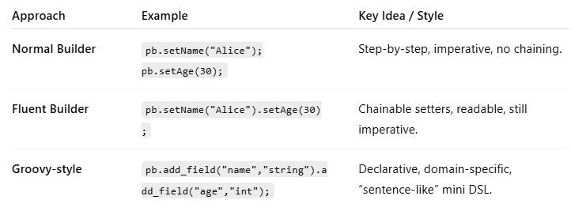

# Builder (Construction)

## Gamma categorization

Creational patterns - Deals with creation of objection
Structural patters - Deals with class members
Behavioral pattern - No central theme, all objects are different

## Builder

### Purpose

1. Simplifies creation of complex objects step by step.
2. Helps manage object construction when multiple fields or configurations exist.
3. Avoids long constructors with many parameters.

### Normal Builder Approach

Use a separate builder class to create objects.
No method chaining.

Example:
```
#include <string>
#include <vector>
#include <iostream>
using namespace std;

class Person 
{
public:
    string name;
    int age;
};

class PersonBuilder 
{
    Person p;
public:
    void setName(const string& name) 
    { 
        p.name = name; 
    }
    void setAge(int age) 
    { 
        p.age = age; 
    }
    Person build() 
    {
        return p;
    }
};

int main() 
{
    PersonBuilder pb;
    pb.setName("Alice");
    pb.setAge(30);
    // build() constructs the object.
    Person p = pb.build();
    cout << p.name << ", " << p.age << endl;
}
```

### Fluent Builder

Builder methods return *this (reference) → enable method chaining.
Advantages:
1. Cleaner, readable.
2. Supports chaining → "fluent" style.

Example:
```
class PersonBuilder 
{
    Person p;
public:
    PersonBuilder& setName(const string& name) 
    { 
        p.name = name; return *this; 
    }
    PersonBuilder& setAge(int age) 
    { 
        p.age = age;
        // Pointer to the current object
        return *this; 
    }
    Person build() { return p; }
};

int main() 
{
    Person p = PersonBuilder()
                   .setName("Bob")
                   .setAge(25)
                   .build();

    cout << p.name << ", " << p.age << endl;
}
```

### Groovy-style / Domain-Specific Builder

1. Extremely concise, often uses chaining directly in constructors or builder objects.
2. Sometimes uses a combination of operator overloading or closures (more common in languages like Groovy/Scala).

Example:

```
class Person 
{
public:
    string name;
    int age;
};

class PersonBuilder 
{
    Person p;
public:
    // Single function to update multiple properties - IMPORTANT characterstic of groovy
    PersonBuilder& configure(const string& name, int age) {
        p.name = name;
        p.age = age;
        return *this;
    }

    // Optional: still support printing or finalizing
    Person build() { return p; }
};

int main() 
{
    Person p = PersonBuilder()
                   .configure("Bob", 25)   // single declarative function
                   .build();
}
```


### Comparison

